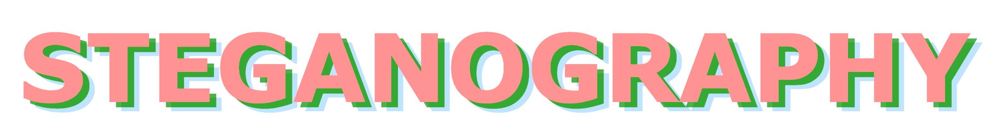

# Steganography From Scratch

What is Steganography?

# Quick install

# Who am I?

I am Ítalo de Pontes Oliveira, Master's in Computer Vision and Data Scientist.

[Link](https://docs.google.com/document/d/1Wz_oqnyiWBoPQqESW-rKTz4bCPeYhu4qduBa3W660JA/edit?usp=sharing) to my CV (on-line version).

[Link](data/My-cv-Italo-de-Pontes-Oliveira.pdf) to my CV (PDF version), perhaps outdate.