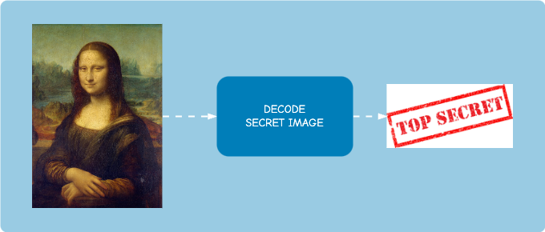

## Implementing Steganography from scratch using Python

[](https://github.com/italoPontes/Steganography)

What is Steganography?

# Quick install

```
pip install -r requirements.txt
```
- numpy==1.26.4
- opencv-python-headless==4.9.0.80
- Pillow==10.2.0
- streamlit==1.32.0

# How to use?


```
python how-to-use.py encode -secret_image data/secret-image.jpg -cover_image data/Monalisa.png -output_image data/steganography-image.png
```




```
python how-to-use.py decode -steganography_image data/steganography-image.png -secret_image data/retrieved.png
```

# Who am I?

I am Ítalo de Pontes Oliveira, Master's in Computer Vision and Data Scientist.


<a href="https://www.linkedin.com/in/italo-de-pontes/">

</a>

[Link](https://docs.google.com/document/d/1Wz_oqnyiWBoPQqESW-rKTz4bCPeYhu4qduBa3W660JA/edit?usp=sharing) to my CV (on-line version).

[Link](data/My-cv-Italo-de-Pontes-Oliveira.pdf) to my CV (PDF version), perhaps outdate.